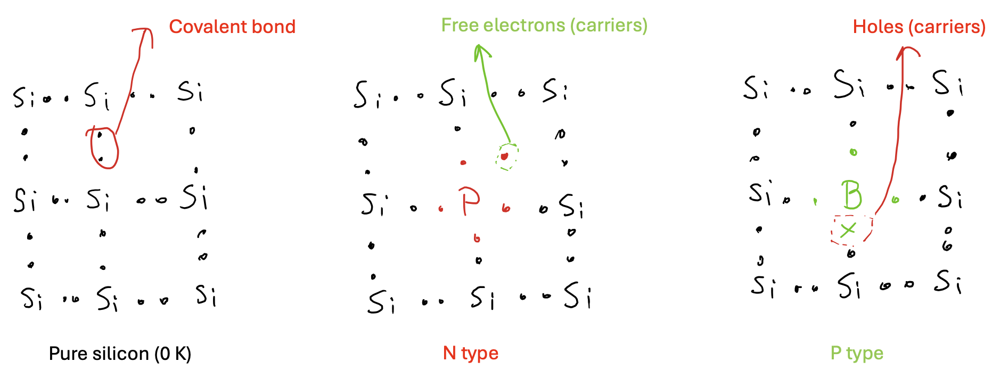
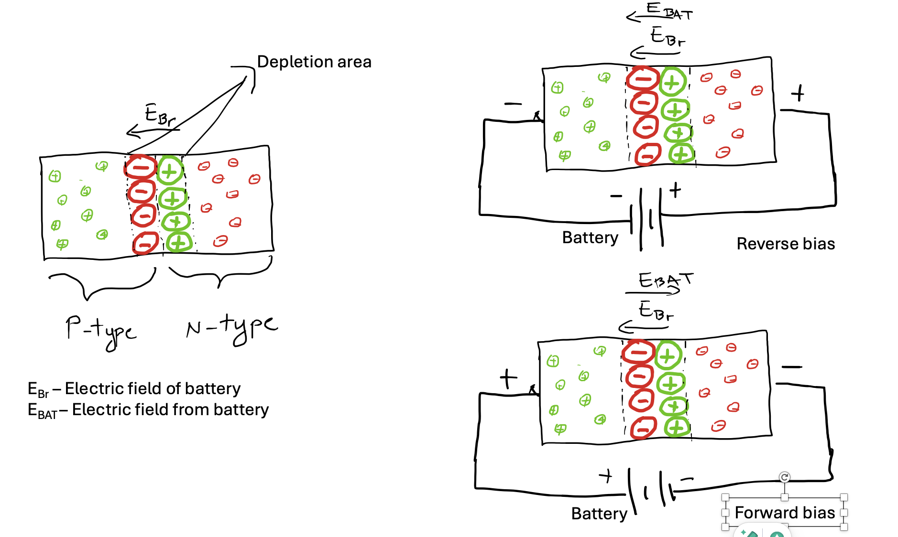
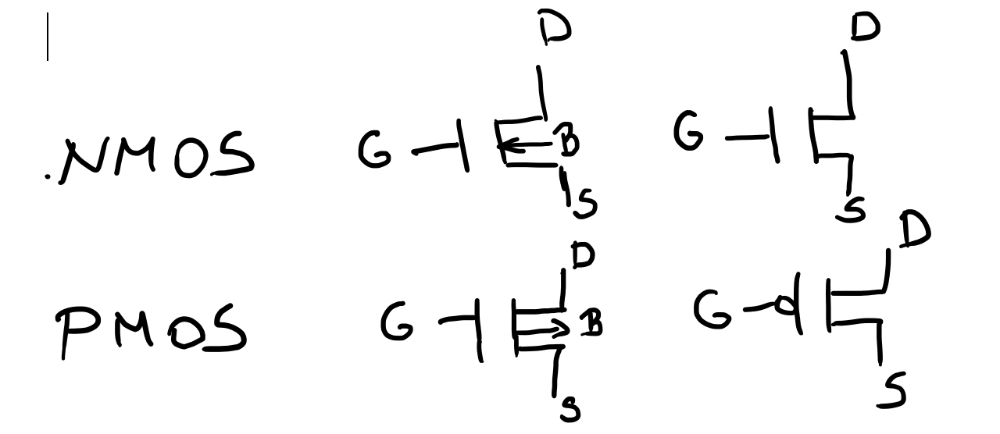
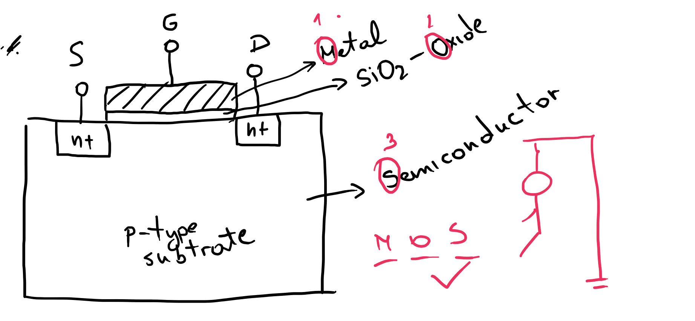
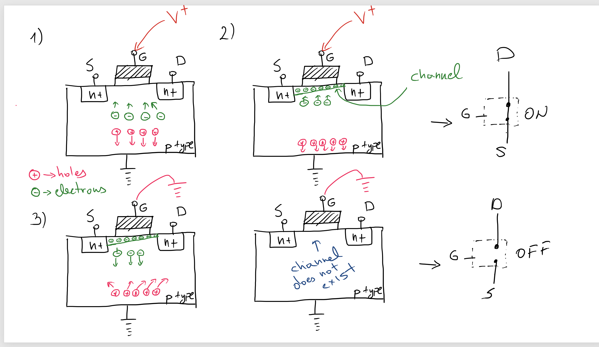
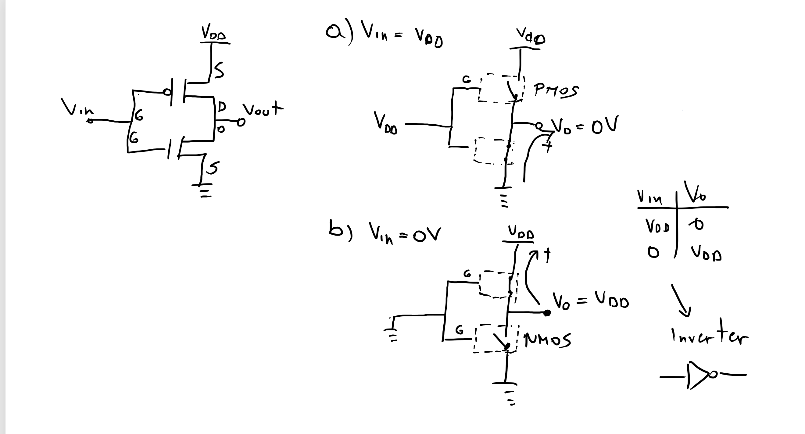
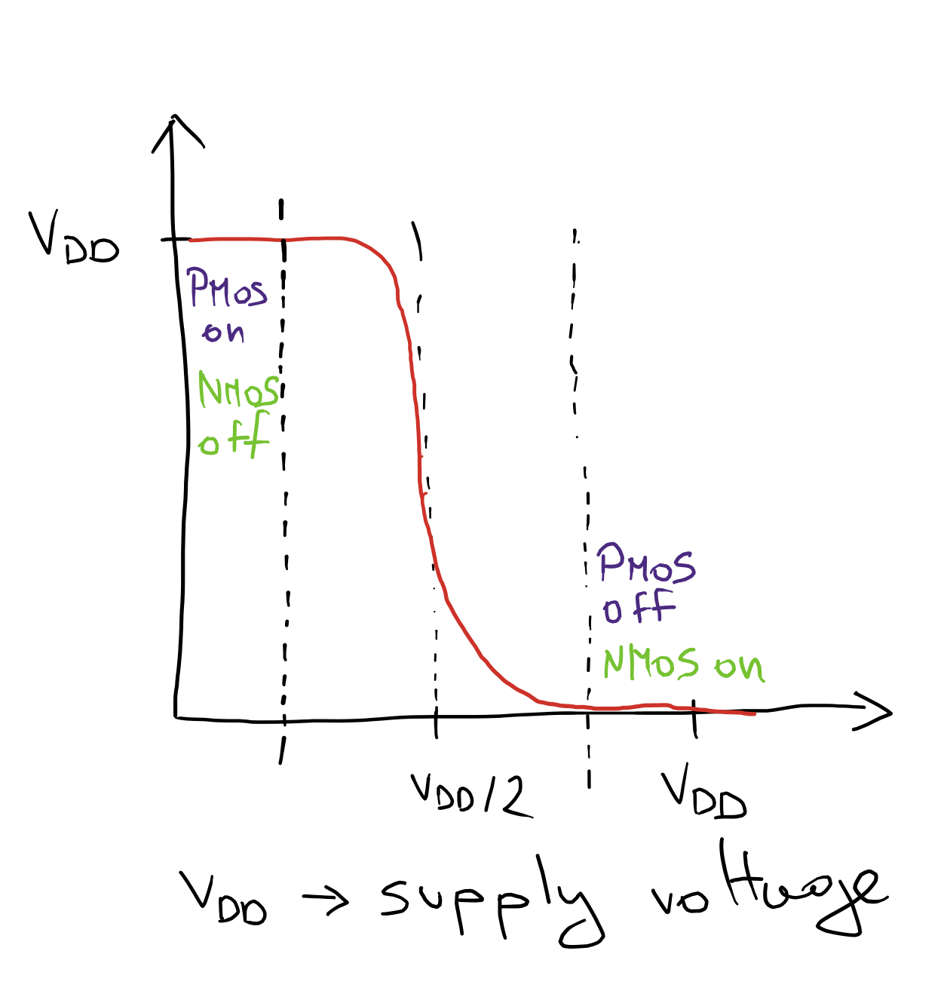
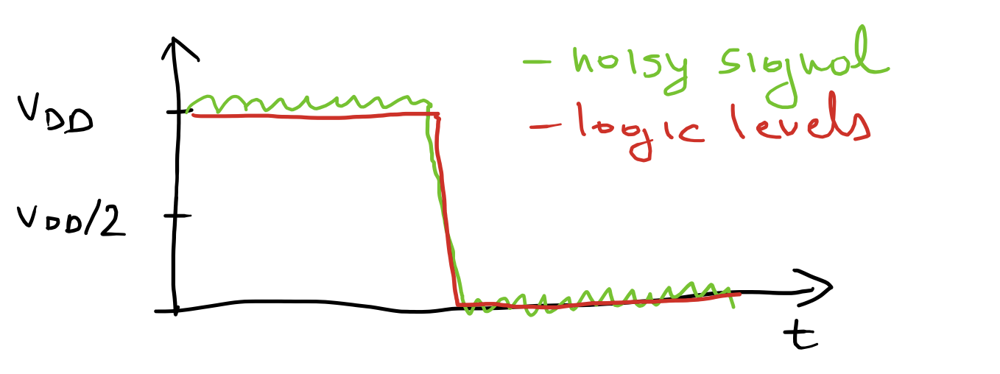
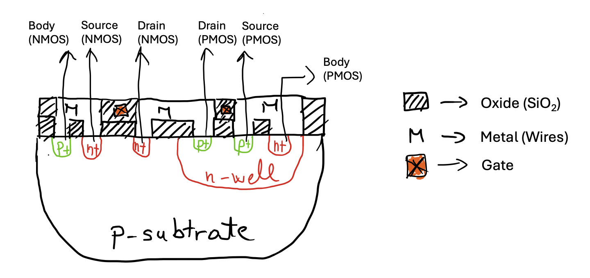

# Introduction to Digital Design {#sec-digital-design-intro .unnumbered}

## Goal for this week

- See why the P-N junction's one-way conduction is the basic building block
  behind every diode and every transistor
- Follow how a MOSFET's gate voltage creates, and destroys, a conducting
  channel between source and drain, turning it into a voltage-controlled
  switch
- Build the CMOS inverter from one NMOS and one PMOS, and see why that
  pairing is what gives CMOS its low static power
- Separate static and dynamic power, and see which design choices trade one
  for the other
- Connect the transistor-level picture to the chip-level one: how NMOS and
  PMOS actually end up side by side on the same piece of silicon, and
  roughly how a wafer becomes a chip

## The P-N junction

{width="600px"}

::: {.content-visible when-format="revealjs"}
- Pure silicon is a poor conductor. Doping fixes that
- **N-type**: dope with phosphorus/arsenic (more valence electrons). Free
  electrons become the majority carrier
- **P-type**: dope with boron/gallium (fewer valence electrons). Free holes
  become the majority carrier
- A P-N junction conducts easily in one direction (forward bias) and blocks
  the other (reverse bias). That asymmetry is the diode
:::

::: {.content-visible unless-format="revealjs"}
One of the fundamental facts of solid-state electronics is how a P-N
junction behaves. On its own, pure silicon is a poor conductor. We fix that
through doping, deliberately introducing a small number of impurity atoms
into the silicon lattice to change how many free charge carriers it has.
Dope silicon with an element that has more valence electrons than silicon,
such as phosphorus or arsenic, and the extra electrons become free
carriers. We call the result n-type silicon, "n" for the negative charge
of its majority carrier. Dope it instead with an element that has fewer
valence electrons, such as boron or gallium, and the missing electron
leaves behind a "hole", a position that behaves like a mobile positive
charge. We call that p-type silicon.

Bring a block of n-type and a block of p-type silicon into contact, and
the junction between them behaves in a way neither material does alone.
Current flows easily in one direction, forward bias, and is almost
completely blocked in the other, reverse bias. This one-way behavior is
not a separate property we add. It falls directly out of how charge moves
across the junction, and it is the basic mechanism behind every diode,
and in turn, every transistor we build in this course.
:::

### The depletion region

{width="700px"}

::: {.content-visible when-format="revealjs"}
- Electrons near the junction diffuse into the p-side, holes diffuse into
  the n-side. They recombine, leaving a thin region with no free carriers:
  the **depletion region**
- That region's fixed charges create a built-in electric field that
  opposes further diffusion. **Equilibrium**
- **Reverse bias**: external field reinforces the built-in field, widens
  the depletion region, blocks conduction
- **Forward bias**: external field opposes the built-in field, shrinks the
  depletion region, enables conduction
:::

::: {.content-visible unless-format="revealjs"}
Right at the junction, free electrons from the n-side and free holes from
the p-side meet and recombine, leaving behind a thin region with no free
carriers at all. We call this the depletion region. What is left behind
there is not neutral. It is the fixed, immobile dopant ions that donated
those carriers in the first place, and those fixed charges set up an
electric field across the depletion region, pointing from the n-side
toward the p-side.

#### Equilibrium

With no external voltage applied, that built-in field reaches a balance
point. It is strong enough to stop any further electrons or holes from
diffusing across the junction, but no stronger. We call this the
equilibrium state. Electrically, it behaves like a small built-in
barrier, often called the Coulomb barrier, that a carrier has to overcome
before it can cross from one side to the other.

#### Reverse bias

Apply an external voltage with its positive terminal on the n-side, and
that external field points the same way as the junction's built-in field.
The two add together, the depletion region widens, and the barrier an
electron would need to cross gets taller, not shorter. For current to
flow at all, electrons from the n-side would have to reach the junction
and recombine with holes on the p-side, and a reverse-biased junction
actively drives electrons away from the junction instead. The result is
that almost no current flows.

#### Forward bias

Flip the polarity, and the external field now opposes the built-in field
instead of reinforcing it. The depletion region shrinks, the Coulomb
barrier collapses, and carriers can cross the junction with very little
resistance. This is forward bias, and it is the conducting state of a
diode.
:::

## CMOS technology

::: {.content-visible when-format="revealjs"}
- **CMOS**: Complementary Metal-Oxide-Semiconductor, built from paired
  NMOS and PMOS transistors
- Dominant because of low static power, high noise immunity, and fast
  switching
- The reason it is everywhere, from microcontrollers to the FPGAs and
  RISC-V cores we build later in this course
:::

::: {.content-visible unless-format="revealjs"}
Complementary Metal-Oxide-Semiconductor (CMOS) technology is, practically
speaking, unavoidable in digital design. It builds every logic function
from paired n-type and p-type MOSFETs, and that pairing is what lets it
combine very low static power with high noise immunity and fast
switching, all at once. That combination is exactly what large-scale
integration needs, whether that means a battery-powered microcontroller
or the millions of logic gates on a modern microprocessor. Every digital
building block we design in this course, down to the CLB we met in the
FPGA fabric, ultimately bottoms out in CMOS transistors like the ones in
this chapter.
:::

### MOSFET transistors

{width="500px"}

::: {.content-visible when-format="revealjs"}
- A MOSFET is, first and foremost, a voltage-controlled switch
- Four terminals: **gate**, **source**, **drain**, **body**. The body is
  normally tied to a fixed supply rail
- MOSFET = Metal-Oxide-Semiconductor Field-Effect Transistor. A field
  effect, not a direct physical connection, controls the channel
:::

::: {.content-visible unless-format="revealjs"}
We will mostly use the MOSFET as a switch, though it can also amplify
signals. At first glance it looks like a four-terminal device: gate,
source, drain, and body. A voltage on the gate decides whether, and how
strongly, current can flow between source and drain. The body terminal
shifts the device's voltage-current characteristics and is normally just
tied to a fixed supply rail, which is why many schematic symbols leave it
out and show only three terminals.

The name spells out what the device is built from. "Metal-Oxide-
Semiconductor" describes its physical structure. "Field-Effect Transistor"
describes how it works: an electric field, not a direct physical
connection, controls the current.
:::

{width="500px"}

::: {.content-visible when-format="revealjs"}
- Gate: a metal layer separated from the substrate by an oxide insulator.
  No DC current can flow into it
- Source and drain: n+ regions embedded in a p-type substrate (for an
  NMOS)
- **Source**: supplies the carriers that flow through the channel.
  **Drain**: where they leave
:::

::: {.content-visible unless-format="revealjs"}
We illustrate an NMOS. Its gate is a metal layer separated from the
p-type substrate beneath it by a thin oxide layer, which insulates the
gate and prevents any DC current from flowing into it. Source and drain
are both n+ regions embedded directly in that p-type substrate. The names
describe their role in conduction: the source supplies the charge
carriers, electrons for an n-channel device and holes for a p-channel
one, that flow through the channel, and the drain is where those carriers
leave it.
:::

{width="700px"}

::: {.content-visible when-format="revealjs"}
- Positive gate voltage attracts electrons from the p-type substrate
  toward the surface, pushing holes away
- Enough electrons collect to form a conducting **channel** bridging
  source and drain. Current can now flow
- Remove the gate voltage and the channel dissolves. The switch is a
  field, and it only exists while the field does
:::

::: {.content-visible unless-format="revealjs"}
To turn an NMOS on, we apply a positive voltage to the gate. That voltage
attracts electrons from the p-type substrate toward the surface and
pushes holes downward and away, purely through the electric field it
creates, which is exactly what makes this a field-effect transistor. Once
enough electrons have gathered at the surface, they form a bridge, the
channel, connecting source and drain, and current can flow between them.
How long that channel is, geometrically, is a property of the
fabrication technology used.

In effect, the MOS transistor behaves as a controlled switch. Take the
voltage off the gate, and the electrons no longer have anywhere to stay.
The channel dissolves, and the connection between drain and source opens
back up.
:::

### Complementary MOS

{width="700px"}

::: {.content-visible when-format="revealjs"}
- A CMOS gate pairs one NMOS and one PMOS, sharing a common gate input
- Input high: NMOS on, PMOS off. Output pulled to ground
- Input low: PMOS on, NMOS off. Output pulled to VDD
- Exactly one of the two is ever on. That is why static power is so low:
  this is an **inverter**
:::

::: {.content-visible unless-format="revealjs"}
A CMOS gate pairs an NMOS and a PMOS transistor that share a common gate
input. We already know how to turn an NMOS on, and a PMOS is its mirror
image: it turns on when the gate is low rather than high. Tie a positive
voltage to the shared gate, and the NMOS turns on while the PMOS turns
off, pulling the output down to ground. Tie the gate to ground instead,
and the PMOS turns on while the NMOS turns off, pulling the output up to
VDD. In both cases, exactly one of the two transistors conducts, never
both, and the output ends up at the opposite logic level from the input.
That is an inverter, and it is the simplest possible CMOS gate.
:::

## CMOS characteristics

### Transfer function

{width="400px"}

::: {.content-visible when-format="revealjs"}
- The transfer function plots output voltage against input voltage
- Flat near VDD while the input is low (PMOS on, NMOS off), flat near
  ground while the input is high (PMOS off, NMOS on)
- A sharp transition around VDD/2, where both transistors are briefly on
  at once
:::

::: {.content-visible unless-format="revealjs"}
The transfer function shows how the output voltage depends on the input
voltage. For a CMOS inverter, it is almost a step function. For a wide
range of low inputs, the PMOS is on and the NMOS is off, and the output
sits close to VDD. For a wide range of high inputs, the roles reverse and
the output sits close to ground. Only in a narrow band around VDD/2 do
both transistors conduct at once, and the output swings sharply from one
rail to the other. That sharp transition is exactly what we want from a
digital gate. It is what keeps a "1" looking like a clean 1 and a "0"
looking like a clean 0, right up until the input crosses the switching
threshold.
:::

### Noise margins

{width="400px"}

::: {.content-visible when-format="revealjs"}
- High and low output levels sit close to VDD and ground, with a wide
  flat region around each
- Noise riding on a signal only matters if it pushes the voltage past the
  switching threshold
- This wide margin is a big part of why CMOS is so robust against noise
:::

::: {.content-visible unless-format="revealjs"}
Because the transfer function stays flat near VDD and near ground across
most of the input range, a CMOS gate tolerates a surprising amount of
noise. A signal can pick up noise from neighboring wires or supply
fluctuations and still be read correctly, as long as that noise does not
push the voltage past the switching threshold in the middle of the
transfer function. This margin between "close enough to a clean logic
level" and "close enough to flip the gate's decision" is the noise
margin, and CMOS's wide noise margins are one of the main reasons it
dominates digital design.
:::

### Power

CMOS technology is known for its low power consumption, which is one of
its biggest advantages over older logic families. We split that power
consumption into two categories: static power and dynamic power.

**Static power** (also called leakage power) is what the circuit
consumes while it is not switching at all. It comes mostly from small
leakage currents through transistors that are nominally off, and it
becomes a much bigger concern as transistor geometries shrink.

**Dynamic power** is what the circuit consumes while it is actively
switching. Every time a gate's output toggles, we have to charge or
discharge its load capacitance, and that costs energy. We can express the
dynamic power of a single node as

$$P_{dynamic} = \alpha C V^2 f$$

where $\alpha$ is the activity factor (the fraction of clock cycles in
which the node actually switches), $C$ is the load capacitance, $V$ is
the supply voltage, and $f$ is the switching frequency.

### Dynamic behavior

::: {.content-visible when-format="revealjs"}
- A gate does not switch instantly. It has to charge or discharge its
  load capacitance first
- Load capacitance = next gate's input capacitance + interconnect
  capacitance + reverse-biased junction capacitance
- Levers to reduce delay: raise supply voltage, widen the channel (raise
  W/L), or drive fewer downstream gates
:::

::: {.content-visible unless-format="revealjs"}
A CMOS gate does not switch instantaneously. To change its output, it
first has to charge the load capacitance, when the output rises, or
discharge it, when the output falls. That load capacitance is not one
single thing. It is the sum of the input capacitance of every gate the
output drives, the capacitance of the interconnect wiring between them,
and the capacitance of the reverse-biased P-N junctions inside the
transistors themselves. To make a gate switch faster, we have a few
levers: raise the supply voltage, widen the transistor's channel
width-to-length ratio, or simply drive fewer downstream gates from the
same output.
:::

## Manufacturing CMOS integrated circuits

{width="700px"}

::: {.content-visible when-format="revealjs"}
- NMOS and PMOS have to coexist on the same piece of silicon
- An **n-well**, a pocket of n-type silicon inside the p-type substrate,
  gives the PMOS the material it needs without disturbing the NMOS
  around it
:::

::: {.content-visible unless-format="revealjs"}
Building CMOS means putting NMOS and PMOS transistors on the very same
piece of silicon, even though an NMOS wants a p-type substrate and a
PMOS wants an n-type one. The usual solution is an n-well: a pocket of
n-type silicon diffused into the p-type substrate, deep enough to host a
complete PMOS transistor, source, drain, and body, while the NMOS
transistors around it sit directly in the surrounding p-type substrate as
before. Everything above that, the oxide layers and the metal wiring that
connects the transistors into actual logic gates, is built in the same
set of process steps for both transistor types.
:::

### Photolithography process

::: {.content-visible when-format="revealjs"}
- Start with a bare silicon wafer
- Oxidation: grow a thin SiO2 layer over the whole wafer
- Photoresist coating: spin on a light-sensitive polymer
  - **Negative** resist (the default): becomes soluble where light hits
    it
  - **Positive** resist: the opposite
- Stepper exposure: a glass mask with the pattern is aligned over the
  wafer, and UV light exposes it through the mask's transparent regions
- Development and baking: dissolve away the exposed (or unexposed)
  resist, then bake to harden what remains
- Acid etching: remove the oxide (or other material) wherever it is not
  protected by resist
- Spin, rinse, and dry, then repeat the relevant steps for the next layer
- Resist strip: remove the remaining photoresist, ready for the next
  layer
:::

::: {.content-visible unless-format="revealjs"}
Turning a bare silicon wafer into a working chip is a repeated pattern of
deposit, pattern, and etch, applied layer by layer. It starts with the
wafer itself, onto which we grow a thin layer of silicon dioxide (SiO2)
through oxidation. On top of that, we spin on a photoresist, a
light-sensitive polymer. By default we use a negative resist, which
becomes soluble wherever light hits it, though a positive resist, which
behaves the opposite way, is also an option depending on the process.

Next comes the stepper exposure. A glass mask carrying the pattern for
this layer is brought close to the wafer. Its opaque regions block UV
light, and its transparent regions let it through, exposing the resist
beneath in exactly the shape we want to process. After exposure, we
develop and bake the wafer: an acid or base solution washes away the
soluble part of the resist, and baking hardens what is left into a solid
protective mask.

With that mask in place, acid etching removes material, typically the
oxide layer, wherever the resist is not protecting it. A spin, rinse, and
dry step cleans the wafer before whatever comes next, whether that is
another masked layer or a different process step entirely. Once a layer
is finished, we strip away the remaining photoresist, and the wafer is
ready for the next pass through this same cycle, one layer at a time,
until the full set of transistors and interconnect is complete.
:::
