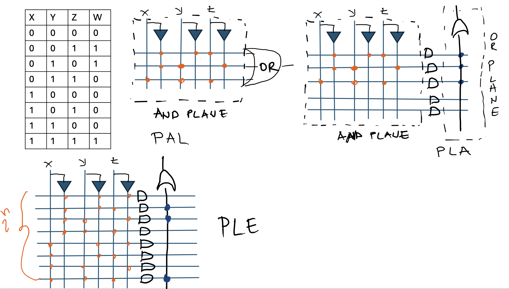

# Basics of Digital Integrated Circuits {#sec-digital-ic-basics .unnumbered}

## Goal for this week

- Classify integrated circuits by fabrication technology (bipolar,
  MOS/CMOS, BiCMOS) and by scale of integration, and see why Moore's law
  is the reason those scales keep climbing
- Separate the IC business models: standard parts built for nobody in
  particular, full-custom ASICs built for one customer, and the
  semi-custom middle ground
- See how standard cells, macrocells, and gate arrays let an ASIC
  designer reuse pre-built blocks instead of hand-laying every transistor
- Meet the predecessors to the FPGA: SPLDs (PAL, PLA, PLE) and CPLDs, and
  the handful of underlying technologies a chip can use to store its
  configuration

## Digital integrated circuits

::: {.content-visible when-format="revealjs"}
- A digital IC: a miniature, low-cost circuit of active and passive
  elements, fabricated on a single silicon die
- Classify by fabrication technology:
  - **Bipolar (BJT)**
  - **Unipolar**: MOS, CMOS
  - **Mixed**: BiCMOS
:::

::: {.content-visible unless-format="revealjs"}
A digital integrated circuit (IC) is, in simple terms, a miniature,
low-cost circuit made of active and passive elements, all fabricated
together on a single silicon die. We can classify ICs by the transistor
technology they are built from: bipolar junction transistors (BJT),
unipolar MOS or CMOS transistors like the ones we met in the previous
chapter, or a mix of both, called BiCMOS.

Bipolar junction transistors have real advantages over CMOS. They switch
at higher frequencies, offer better gain, and can drive higher output
currents. CMOS wins anyway for almost all digital design, because a
BJT's static power consumption is never quite zero, and BJTs are larger
and slower to fabricate at a given density. That is exactly the
low-static-power, high-density tradeoff that made CMOS the default
technology in the previous chapter.
:::

### Scale of integration

::: {.content-visible when-format="revealjs"}
- **SSI**: up to 100 basic elements
- **MSI**: 100 to 1,000
- **LSI**: 1,000 to 10,000
- **VLSI**: 10,000 to 100,000
- **ULSI**: 100,000 to 1,000,000
- **Wafer-scale integration**: an entire wafer as one circuit
- **Moore's law**: transistor counts per chip have roughly doubled every
  two years since the 1960s, which is why this list keeps growing
:::

::: {.content-visible unless-format="revealjs"}
We also classify ICs by their scale of integration, a rough measure of
how many basic elements, transistors or gates, fit on one chip. Small
scale integration (SSI) covers up to about 100 elements, medium scale
(MSI) 100 to 1,000, large scale (LSI) 1,000 to 10,000, very large scale
(VLSI) 10,000 to 100,000, and ultra large scale (ULSI) 100,000 to
1,000,000. Beyond that, wafer-scale integration treats an entire silicon
wafer as a single circuit rather than cutting it into individual dies.

This progression is not just a naming exercise. Gordon Moore observed in
1965 that the number of transistors we can fit on a chip roughly doubles
every two years, a trend we now call Moore's law. It is the reason the
scale of integration climbed from a handful of gates per chip in the
1960s to transistor counts in the billions today, and it is the main
force behind nearly every capability we take for granted in modern
digital design.
:::

## Design methodologies

::: {.content-visible when-format="revealjs"}
- **Standard IC (SIC)**: built for an unknown customer, mass-produced
- **ASIC**: built for one customer or application. Full-custom or
  semi-custom
- **SASIC**: standard parts that get configured after fabrication to
  behave like a custom one
:::

::: {.content-visible unless-format="revealjs"}
We can also classify digital ICs by who they are designed for, which we
call their design methodology: standard ICs (SIC), application-specific
ICs (ASIC), and standard ASICs (SASIC).
:::

### Standard integrated circuits

::: {.content-visible when-format="revealjs"}
- Targeted at an unknown customer. The end user has no influence on the
  design
- Mass-produced, which is what makes them cheap
- Early SICs were fixed-function. Building a system meant wiring many of
  them together on a board
- Software-programmable SICs, above all the CPU, offer far more
  flexibility: reprogram the task instead of rewiring the board
:::

::: {.content-visible unless-format="revealjs"}
A standard IC is designed for an unknown customer. Whoever eventually
buys the chip has no influence on how it was designed, and that is
exactly what lets it be mass-produced and sold cheaply.

The earliest standard ICs were simple, fixed-function parts, and building
any larger system out of them meant wiring together many of them on a
board to form whatever circuit was needed. Software-programmable standard
parts changed that, above all the CPU: the same piece of hardware adapts
to a new task just by changing the program it runs, instead of changing
its wiring. That flexibility is not free. A general-purpose CPU is rarely
the most efficient way to run any one specific task, a tradeoff we look
at more closely when we get to FPGAs later in this book.
:::

### Application-specific integrated circuits

::: {.content-visible when-format="revealjs"}
- Targeted at one specific application or field
- Two flavors: **full-custom** and **semi-custom**
:::

::: {.content-visible unless-format="revealjs"}
An application-specific integrated circuit (ASIC) is designed for one
specific application or field, rather than for an unknown general-purpose
market. We build ASICs in two ways: full-custom and semi-custom.
:::

#### Full-custom design

::: {.content-visible when-format="revealjs"}
- Built specifically for one customer. Every mask layer is designed to
  order
- Design is confidential, tailored to the customer's exact need (e.g. a
  systolic array, genome analysis, a dedicated accelerator)
- High price per chip: the design cost is comparable to an SIC, spread
  over a much smaller production run
:::

::: {.content-visible unless-format="revealjs"}
A full-custom design is built specifically for one customer, with every
mask layer needed to fabricate the chip designed to order for that
customer's exact need, whether that is a systolic array, genome analysis
hardware, or a dedicated accelerator. The design itself is typically
strongly confidential. Since the design cost is comparable to a standard
IC's but spread over a far smaller production run, full-custom chips
carry a high price per unit.
:::

#### Semi-custom design

::: {.content-visible when-format="revealjs"}
- Predesigned or preprocessed chips. Only some mask layers are adapted to
  the customer, the rest stay identical across customers
- The manufacturer has a library of pre-tested modules and connects them
  according to the customer's requirements, rather than starting from
  scratch
- Much cheaper per unit, since the same base design serves many customers
:::

::: {.content-visible unless-format="revealjs"}
Semi-custom design starts from a predesigned or preprocessed chip. Only
certain mask layers get adapted to the customer's needs, while the rest
stay identical across every customer who buys that base design. The
manufacturer keeps a library of pre-tested modules on hand and connects
them to fit each customer's requirements, rather than designing from
scratch every time. Because the same base design is reused across many
customers, semi-custom chips are much cheaper per unit than full-custom
ones.
:::

### Building blocks for ASIC design

{width="700px"}

::: {.content-visible when-format="revealjs"}
- **Standard cells**: small, universal building blocks (logic gates,
  flip-flops, muxes), each with a predefined layout and a fixed cell
  height so they tile into rows
  - Routing runs above the cell rows: over-the-cell routing
  - The full library of standard cells is called a **Process Design Kit
    (PDK)**
- **Macrocells / megacells**: larger pre-laid-out blocks (adders,
  multipliers, registers, even whole processors)
  - Megacell: designed without a specific customer in mind, more reusable
  - Macrocell: designed to order for one customer
- **Gate arrays**: pre-fabricated gates or unconnected transistors.
  Implementing a design is purely a metal-wiring problem
  - Older gate arrays left routing channels between blocks
  - "Sea of gates" designs pack transistors edge to edge and route over
    higher metal layers, connecting them by shorting or bridging
    transistors that were otherwise left unconnected
:::

::: {.content-visible unless-format="revealjs"}
Semi-custom and standard-cell ASIC design rests on a few kinds of reusable
building block.

Standard cells are small, universal blocks, logic gates, flip-flops,
multiplexers, and the like, each with a predefined layout and electrical
behavior. The figure above shows a two-input NAND gate as a standard
cell: its transistor schematic, its layout in metal, polysilicon, and
diffusion layers, and the fixed-height block that results, ready to sit
in a row next to other cells. Every standard cell in a library shares that
same row height, which is what lets thousands of them be tiled into rows
and wired together with routing that runs above the cells, so-called
over-the-cell routing. A chip's entire library of standard cells, together
with the data needed to use them, is called a process design kit (PDK).

Macrocells and megacells are a step up from standard cells: larger,
pre-laid-out blocks such as adders, multipliers, registers, or even whole
microprocessors. The difference between the two is who they were designed
for. A megacell is designed without knowledge of the specific application
that will use it, which makes it broadly reusable, while a macrocell is
designed to order for one customer's needs.

Gate arrays take a different approach. Their basic elements, individual
gates or groups of unconnected transistors, are pre-fabricated across the
whole die before any customer design is known. Implementing a specific
design on a gate array is then purely a metal-wiring problem: connect the
gates that are already there in whatever pattern the design needs. Early
gate arrays separated these blocks with dedicated routing channels. Later
"sea of gates" designs packed transistors edge to edge instead and used
higher-level metal layers for routing, improving density, with
connections made by shorting or bridging transistors that would otherwise
stay unconnected.
:::

## Standard ASICs (SASIC)

::: {.content-visible when-format="revealjs"}
- A SASIC is manufactured generically, like a standard IC, then
  configured after fabrication to behave like a custom one
- What changes from chip to chip is not the silicon. It is a set of
  configuration bits
:::

::: {.content-visible unless-format="revealjs"}
A standard ASIC (SASIC), also called a configurable ASIC, is manufactured
generically, the same way a standard IC is, and only afterward configured
to behave like a custom one. What changes from one application to the
next is not the silicon itself. It is a set of configuration bits, held
in one of a handful of underlying technologies.
:::

### Configuration technologies

::: {.content-visible when-format="revealjs"}
- **Static memory**: config bits live in SRAM and drive switches
  (transmission gates, tri-state buffers, pass transistors) on or off.
  Volatile
- **UV-erasable memory**: a MOSFET with an isolated **floating gate**.
  A strong lateral field injects electrons onto it, where they stay
  trapped. Erased by exposing the device to UV light
- **Electrically erasable memory**: the same floating-gate idea, but
  erasable electrically instead of optically
- **Fuse / antifuse**: a fuse is a narrow conductive bridge that blows
  open under a programming current. An antifuse is a thin dielectric that
  ruptures under a programming voltage, creating a permanent short.
  Programming is permanent either way
:::

::: {.content-visible unless-format="revealjs"}
Static memory is the technology we will see the most of later in this
book. Configuration bits live in SRAM cells and drive electronic switches
(transmission gates, tri-state buffers, pass transistors) on or off. It
is fast and fully reconfigurable, at the cost of being volatile. This is
the same idea behind the configuration SRAM inside every FPGA we meet
later in this book.

UV-erasable memory stores its configuration differently. Its key element
is a MOSFET with a second gate, electrically isolated and sandwiched
between the control gate and the substrate, called a floating gate. A
strong lateral field between drain and source injects electrons onto that
floating gate, and because it has no conductive path to leak through,
those electrons stay trapped once the field is removed, even with power
off. Erasing the device means shining UV light on it, energetic enough to
let the trapped electrons escape.

Electrically erasable memory keeps the same floating-gate mechanism, but
the device is built so the trapped charge can be removed electrically
instead, without needing a UV lamp.

Fuse and antifuse technologies work differently again, and only in one
direction. A fuse is a narrow bridge of conducting material that blows
open when a programming current is forced through it. An antifuse is the
opposite: a thin dielectric separating two conductive layers, which
ruptures under a programming voltage and creates a permanent short
between them. Either way, programming a fuse-based device is a one-time,
permanent decision, unlike the other three technologies, which can all be
reconfigured.
:::

### Simple programmable logic devices

{width="700px"}

::: {.content-visible when-format="revealjs"}
- Built from one or two programmable logic planes, an **AND plane** and
  an **OR plane**, implementing a function as a sum of products
- Vertical lines: inputs and their inverted values. Horizontal lines:
  product terms
- **PAL** (Programmable Array Logic): AND plane configurable, OR plane
  fixed
- **PLA** (Programmable Logic Array): both planes configurable
- **PLE** (Programmable Logic Element): AND plane fixed (every possible
  product term), OR plane configurable
:::

::: {.content-visible unless-format="revealjs"}
Simple programmable logic devices (SPLDs) are the direct ancestors of the
FPGA, and the simplest configurable logic devices we will meet. Internally,
an SPLD is built from one or two programmable logic planes, an AND plane
and an OR plane, that implement a digital function exactly the way we
would write it out by hand: as a sum of products. Every input, and its
inverted value, runs as a vertical line through the AND plane, and every
horizontal line represents one product term. Which vertical lines feed
which horizontal line, and which product terms feed which output, is
exactly what gets configured.

Which of the two planes is configurable, and which is fixed, gives us
three SPLD variants. In a PAL (Programmable Array Logic) device, the AND
plane is configurable but the OR plane is fixed. In a PLA (Programmable
Logic Array), both planes are configurable, at the cost of more
configuration bits and a larger device. In a PLE (Programmable Logic
Element), the AND plane is fixed and already generates every possible
product term, all $2^n$ of them for $n$ inputs, and only the OR plane,
choosing which of those terms feed each output, is configurable.
:::

### Complex programmable logic devices

{width="750px"}

::: {.content-visible when-format="revealjs"}
- A CPLD is, at its core, many SPLDs on one chip, tied together by a
  programmable interconnect
- Example: Xilinx CoolRunner-II
  - **I/O blocks**: interface to the board
  - **Function blocks**: 32 identical PAL-like logic blocks
  - **AIM** (Advanced Interconnect Matrix): wires function blocks to each
    other and to the I/O blocks
- Each function block: 56 AND terms feeding 16 OR outputs, plus an XOR
  stage and a configurable flip-flop (D / latch / T), with a mux choosing
  combinational or registered output
- Trades the single SPLD's limited capacity for a larger, still fairly
  predictable, device
:::

::: {.content-visible unless-format="revealjs"}
A complex programmable logic device (CPLD) is, at its core, many SPLDs
packaged on one chip and tied together with a programmable interconnect,
trading a single SPLD's limited capacity for a much larger, still fairly
predictable, device.

Take the Xilinx CoolRunner-II as a concrete example. Its I/O blocks
connect the chip to the outside world, the same role they play in the
FPGAs we meet later in this book. Thirty-two identical function blocks
hold the actual logic, and an Advanced Interconnect Matrix (AIM) wires
the function blocks to each other and to the I/O blocks, playing the same
role the FPGA's routing plane plays later.

Each function block looks like a small PAL: 56 AND product terms feeding
16 OR sum outputs. Beyond that core, each output can pass through an XOR
stage, useful for controlled inversion or parity-style logic, and into a
flip-flop resource configurable as a D flip-flop, a level-sensitive
latch, or a toggle (T) flip-flop. An output mux then picks whether the
macrocell's output is the raw combinational result or the registered
one, the same combinational-versus-registered choice the FPGA's CLB
output mux makes.

Tiling many PAL-like blocks together through the AIM lets a CPLD
implement far larger combinational and sequential designs than a single
SPLD could, with timing that stays more predictable, and I/O that
responds faster, than the larger and more routing-heavy FPGAs we look at
later in this book.
:::
