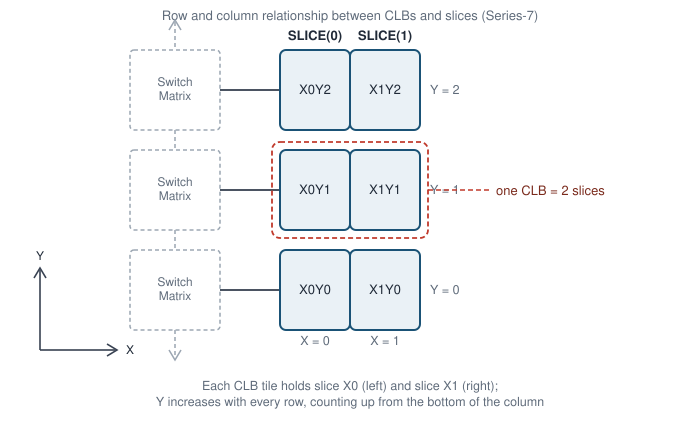
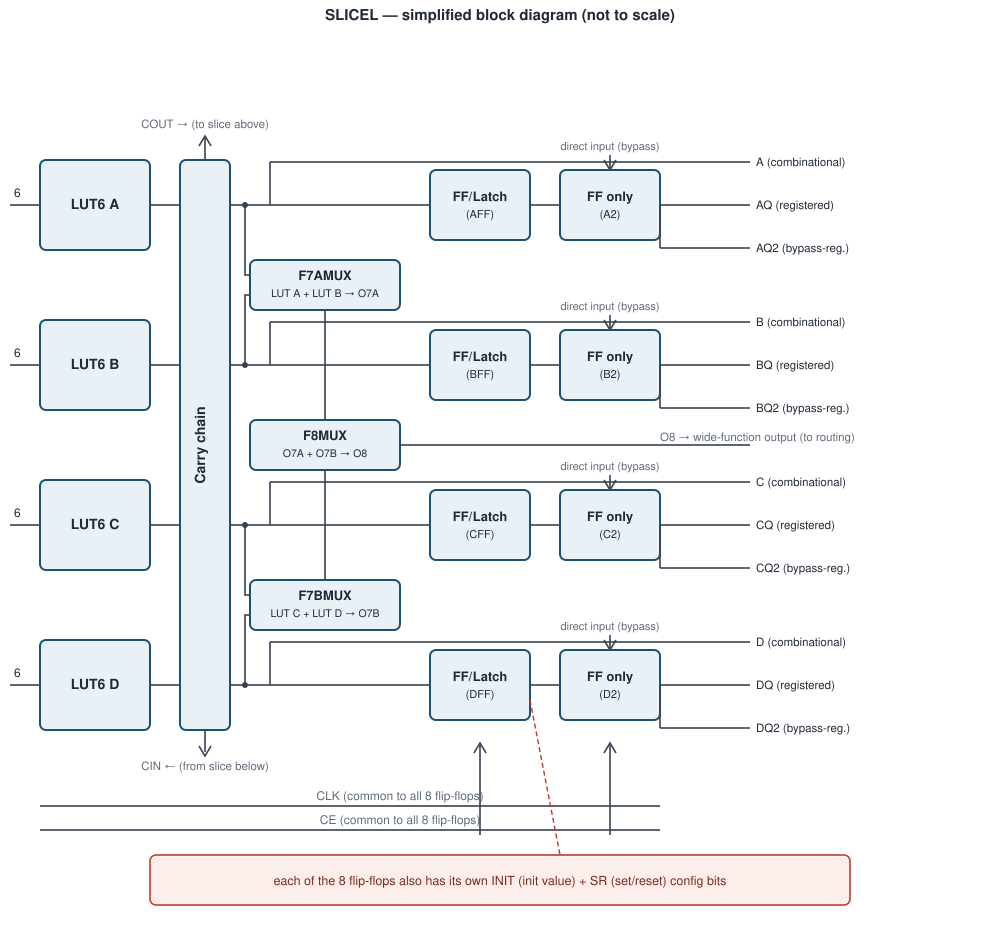

# FPGA Fundamentals {#sec-fpga-basics .unnumbered}

## Goal for this week

- Place the FPGA on the spectrum between a general-purpose CPU and a fixed
  ASIC, and see why that position makes it the right prototyping target for
  this course
- Break the FPGA fabric down into its three building blocks: CLB, routing
  plane, I/O blocks
- Open up a CLB far enough to see the LUT + flip-flop pair that will later
  become "the thing our synthesized SystemVerilog turns into"

## Why reconfigurable hardware?

::: {.content-visible when-format="revealjs"}
- CPU: fixed hardware, flexible software. One datapath, any program
- ASIC: fixed hardware, *no* software. A datapath built for exactly one job
- FPGA: hardware itself is configuration. Same silicon, different circuit
- **Discussion question:** if an ASIC is faster and more power-efficient
  than an FPGA doing the same job, why does this whole course run on FPGAs?
:::

::: {.content-visible unless-format="revealjs"}
As we saw in previous chapters, a CPU is a general-purpose integrated circuit: its function is defined not by its hardware but by the software program a developer writes for it. Development cost and time are low, since a single instruction set can be programmed in general-purpose or domain-specific languages to meet almost any demand — from database search to signal processing and beyond. But this same generality is also the CPU's biggest disadvantage. A CPU performs well on workloads like databases, yet it can be slow on compute-intensive problems such as neural network inference.

ASIC designs overcome this general-purpose bottleneck by mapping the application directly into hardware rather than software. A well-known example is Google's Tensor Processing Unit (TPU), built to accelerate the compute-intensive workloads of neural network inference. Its designers tailored the architecture to that one problem, wiring together a matrix of arithmetic logic units (ALUs) instead of following the standard CPU approach of a five-stage pipeline. Comparing a CPU and a TPU on neural network inference, the TPU wins decisively — but hand it a database search instead, and it is useless. This is the core limitation of ASIC accelerators: each one targets a single application, and once fabricated, it cannot be repurposed for anything else.

Comparing the CPU and the TPU, what we would really like is both properties at once: the flexibility to repurpose the device, and hardware tailored to the application at hand to squeeze out its full potential. Reconfigurable hardware, the field-programmable gate array (FPGA), gives us both, and its name spells out how. "Gate array" comes from the internal structure: logic blocks arranged on a matrix-like fabric, echoing the gate-array architecture used in some ASICs. "Programmable" does not mean the FPGA executes a software program in the traditional sense, though it can in a limited way. Instead, it refers to the reconfigurable property itself, achieved by loading a bitstream, a special binary configuration file, onto the device. "Field" refers to the field of application: an FPGA can adapt its internal structure to whatever application is at hand, out in the field, long after manufacturing.

This is exactly the trade-off an FPGA offers. It sits between the CPU
and the ASIC by turning the hardware itself into a form of software:
the logical function of every building block, and the
wiring between them, is set by the bitstream loaded after
manufacturing. We get most of an ASIC's advantage of "hardware built for
the job" without paying its fixed non-recurring engineering (NRE) cost or
its all-or-nothing commitment. That is exactly why this course
targets FPGAs. A mistake in a lab assignment costs a re-synthesis and a
few minutes, not a re-spun die. FPGAs are also the standard vehicle for
rapid prototyping and hardware acceleration in industry for the same
reason. Reconfigurability turns hardware design into something you can
iterate on.
:::

## The three building blocks

::: {.content-visible when-format="revealjs"}
- **CLB** (Configurable Logic Block): implements the logic itself
- **Routing plane**: programmable wiring that connects CLBs to each other
- **I/O blocks**: the boundary between the fabric and the outside world
:::

::: {.content-visible unless-format="revealjs"}
Every FPGA, regardless of vendor or generation, is built from the same
three kinds of block. CLBs (also called logic elements) sit in a regular
grid and implement the actual logic functions and storage of the design.
Between and around them runs the routing plane: a fabric of wires and
programmable switches whose only job is to connect a CLB's outputs to the
inputs of other CLBs, in whatever pattern the design needs. At the edges of
the die, I/O blocks connect the fabric to physical pins, translating
between the FPGA's internal signal levels and whatever the outside world
expects. None of these three blocks is useful without the other two: a CLB
with no routing to reach it is dead logic, and routing with nothing to
connect is just wire. Placing a design onto an FPGA is precisely the
problem of deciding which CLB implements which piece of logic (placement)
and which routing resources carry the signals between them (routing).
We will meet both steps again when we look at the FPGA design flow.
:::

### Configurable Logic Block (CLB)

::: {.content-visible when-format="revealjs"}
- A **look-up table (LUT)** implements combinational logic by memory
  lookup, not by wiring gates together
- A LUT's inputs act as an *address*. Its output is *the content of the
  addressed memory cell*
- Every CLB slice pairs a LUT with a flip-flop, and a mux picks which one
  drives the output
- That mux, like everything else configurable on the chip, is driven by a
  bit sitting in **configuration SRAM**
:::

::: {.content-visible unless-format="revealjs"}

The CLB is the main carrier of reconfigurability in an FPGA and its elementary building block. You can think of the CLB as the FPGA equivalent of an assembler instruction, the most basic element everything else is built from. The term itself differs across vendors. Xilinx calls it a logic slice, while Altera calls it a logic element. Either way, they refer to the same thing. As the primary building block for digital circuits, a CLB must support combinational logic, sequential logic, and combinations of the two. It consists of a look-up table (LUT), a flip-flop, and an output mux.

A LUT implements combinational logic through memory lookup rather than by wiring gates together. Structurally, it consists of SRAM (static random-access memory) cells paired with a multiplexer that selects which cell's content is forwarded to the output, based on the signal inputs. To see this concretely, consider the smallest useful case, a two-input LUT, or LUT2. With two inputs there are four possible input combinations, so a LUT2 is built from four memory cells and a 4-to-1 multiplexer. The two inputs act as the multiplexer's select lines, in other words as an *address*, and the output is simply whatever bit is stored in the addressed cell.

To implement logical functions with two input variables, you need to map the truth table into SRAM cells. For example to implement a two-input NAND on a LUT2, we do not build a NAND gate at all: we store the NAND truth table's output column (1, 1, 1, 0) into the four memory cells, in the order addressed by the two inputs,
and the LUT now behaves as a NAND for as long as that configuration is
loaded. The reconfigurability of LUTs is what makes FPGAs so flexible: the same LUT can just as easily hold an AND, an XOR, or any other two-input function. Reconfiguring the FPGA never touches a wire between gates. It only rewrites these memory cells. Because those cells are ordinary SRAM, they are volatile: power off the board and the "circuit" is gone, which is why every FPGA design needs a configuration step after every power-up.

We do not build larger LUTs as one giant memory array wired to a huge multiplexer. Instead, real FPGA architectures build them recursively from smaller LUTs, adding one extra input and one extra multiplexer stage at a time. A LUT3 is nothing more than two LUT2s, both fed by the same two inputs, with their outputs chosen between by a 2:1 mux controlled by the third input. Extending the same idea, a LUT4 is built from two LUT3s, each in turn built from two LUT2s, combined by one more 2:1 mux controlled by the fourth input. Each additional input doubles the number of underlying LUT2 building blocks and adds one more layer of multiplexing on top. This recursive structure is exactly why vendors describe their larger LUTs as fracturable: the same physical hardware that implements one LUT4 can, with a small configuration change, split back into two independent LUT3s, or four independent LUT2s, letting the synthesis tool pack more, smaller functions into fewer CLBs when a design does not need the full input width.

Few real digital circuits are purely combinational. Almost every design also needs elements that are synchronous to a clock. To support that, every CLB slice also includes a D flip-flop (DFF) fed from the LUT's output. As we saw earlier, a DFF copies its input (D) to its output (Q) on the active edge of the clock signal, clk. Through configuration bits, the developer can adapt that DFF's behavior, choosing whether it triggers on the rising or falling edge, and setting its initial or reset value. This exposes yet another layer of reconfigurability inside the CLB.

The last element of the CLB is the output mux, which picks between the raw
LUT output and the flip-flop's registered output. That
mux's select line is, like the LUT's memory cells, just another bit in
configuration SRAM. The same physical slice can act as combinational
logic or as a single-bit register, purely depending on how it is
configured. Real devices bundle several LUT + flip-flop slices, wider
LUTs, and extra logic (carry chains, muxes for combining LUTs into wider
functions) into one CLB. We look at a concrete example of that when we
cover a real device architecture later.

:::

### Routing plane: programmable interconnect

::: {.content-visible when-format="revealjs"}
- Routing has two jobs: combine many CLBs into one large design, and
  connect that design to the I/O blocks
- CLBs sit in a grid. The space between them carries wiring **tracks**
- Wherever tracks cross, a **switch box** may connect them
- Each connection point is a **PIP** (Programmable Interconnection Point)
- A PIP is, at the transistor level, just an NMOS pass transistor gated by
  a configuration SRAM bit. `M = 0` leaves the two tracks disconnected,
  `M = 1` ties them together
:::

::: {.content-visible unless-format="revealjs"}
Routing plays two closely related roles. First, it lets many individual
CLBs act as one large digital design: a real circuit needs far more logic
and storage than a single CLB slice can hold, so the design is spread
across hundreds or thousands of CLBs, and routing is what stitches their
individual outputs together into one coherent datapath. Second, routing
connects that internal logic to the outside world, joining CLBs to the
I/O blocks that carry signals in and out of the fabric. Without it, CLBs
and I/O blocks would be correct but disconnected islands of logic.

Between the rows and columns of CLBs run wiring tracks, and at every point
where a horizontal and a vertical track cross, a switch box can optionally
join them. The atomic component of a switch box is the PIP: a single NMOS
transistor used purely as a switch, with its gate driven by one
configuration SRAM bit. When that bit is 0, the transistor is off and the
two tracks it sits between are electrically separate. When it is 1, the
transistor conducts and the tracks become one net. A design's entire
wiring, meaning every connection from one CLB's output to another CLB's
input, reduces to which of these thousands of PIPs are turned on. This is
also why the router is typically the slowest step in the FPGA
implementation tools: placement decides which CLB does what, but routing
has to find, among a huge and only partially connected mesh of tracks and
switch boxes, one specific set of PIPs that realizes every net in the
design without any two nets shorting together.
:::

### I/O blocks

::: {.content-visible when-format="revealjs"}
- I/O blocks are the only place signals leave or enter the fabric
- Output side: optional register, then a **tri-state buffer** gated by an
  output-enable (OE) signal
- Input side: optional register on the way back into the fabric
- Whether a pin is an input, an output, or bidirectional is itself part of
  the configuration
:::

::: {.content-visible unless-format="revealjs"}
An I/O block is the boundary between the reconfigurable fabric and a fixed
physical pin, and it has to support more than "just wire a signal
through." On the output side, a signal from the fabric can optionally be
registered right at the pin before it reaches a tri-state buffer. That
buffer's output-enable (OE) input decides whether the pad is actively
driven at all, which is what makes a genuinely bidirectional pin possible.
The same pad can be released to high-impedance and read as an input
whenever the design is not driving it. The input side mirrors this with
its own optional register. Registering directly in the I/O block, rather
than in the nearest CLB, shortens the path the signal has to travel before
it is captured, which matters because I/O timing margins are usually
tighter than internal fabric timing. As with everything else on the chip,
whether each of these registers is used, and whether a pin behaves as
input, output, or bidirectional, is a configuration decision, not a fact
fixed at fabrication.
:::

### Reconfigurability, level by level

::: {.content-visible when-format="revealjs"}
- **LUT contents**: which function each LUT computes
- **DFF behavior**: edge sensitivity, reset/init value
- **Output mux**: combinational path or registered path
- **Routing PIPs**: which pairs of tracks are joined into one net
- **I/O block**: pin direction, register usage, output-enable
- **All five are the same primitive: one bit in configuration SRAM**
:::

::: {.content-visible unless-format="revealjs"}
We have now seen five separate places where a single configuration SRAM
bit changes what the FPGA does. Inside the CLB, one set of bits picks the
function stored in each LUT, another set picks whether the D flip-flop
triggers on the rising or falling edge and what value it resets to, and
one more bit decides whether the slice's output is the LUT's raw
combinational result or the flip-flop's registered one. Out in the
routing plane, a bit per PIP decides which pairs of tracks are joined into
the same net. At the I/O block, bits decide whether a register is used on
the input or output path, and whether a pin drives, receives, or does
both. None of these is a special case. Every one of them is the same
primitive: an SRAM cell whose value the configuration step writes before
the device does anything useful. What looks like five different kinds of
reconfigurability is really one mechanism, repeated at every point in the
fabric where a design decision has to be made. This is also, in one
sentence, what a bitstream is: the full list of values for every one of
these bits, for every CLB, PIP, and I/O block on the device.
:::

## Case study: Xilinx Series-7

::: {.content-visible when-format="revealjs"}
- Series-7 is one real, concrete implementation of the CLB / routing /
  I/O model we just built
- Four sub-families share the same fabric, differing in size and speed:
  Spartan-7 (low-cost), Artix-7, Kintex-7, Virtex-7 (high-end)
:::

::: {.content-visible unless-format="revealjs"}
We have described the CLB, the routing plane, and the I/O block as three
abstract building blocks, present in every FPGA regardless of vendor or
generation. To see how a real device turns those abstractions into a
concrete architecture, we now look at a specific family: Xilinx Series-7.
Series-7 comprises four sub-families, Spartan-7, Artix-7, Kintex-7, and
Virtex-7, all built from the same underlying fabric while trading off
cost, logic capacity, and signal-processing performance. Spartan-7
targets the low end of that range: small, cost-sensitive, high-volume
applications. Virtex-7 sits at the opposite end, aimed at the highest
connectivity bandwidth, logic capacity, and DSP throughput. Artix-7 and
Kintex-7 fill the middle ground. Every member of the family, from the
smallest Spartan-7 to the largest Virtex-7, is assembled from the same
handful of building blocks described below; only their quantity and mix
change from device to device.
:::

### CLB: SLICEL and SLICEM

::: {.content-visible when-format="revealjs"}
- Xilinx groups two slices into one CLB: **CLB0** (two SLICEL) or
  **CLB1** (one SLICEM + one SLICEL)
- **SLICEL** ("slice logical"): four LUT6s, eight flip-flops, a carry
  chain, and combining muxes
  - F7AMUX / F7BMUX: pair two LUT6s into one LUT7
  - F8MUX: pair the two LUT7s into one LUT8
  - Carry chain: dedicated hardware for fast addition
  - 8 FFs: 4 configurable as FF or latch, 4 as FF only, sharing one
    clock and clock-enable
- **SLICEM** ("slice memory"): everything SLICEL has, plus the option to
  use its LUTs as
  - distributed RAM (small RAM built directly from LUT storage), or
  - a 32-bit shift register
:::

::: {.content-visible unless-format="revealjs"}
Where the generic CLB we described earlier held one LUT and one
flip-flop, a Series-7 CLB is considerably richer, and Xilinx builds it
from two smaller units called slices. Two slice types exist. Every CLB is
either a CLB0, containing two SLICEL ("slice logical") slices, or a CLB1,
containing one SLICEM ("slice memory") and one SLICEL slice. Each slice,
of either type, contains four six-input LUTs (LUT6) rather than the
single LUT2 we used to introduce the idea — the same recursive
fracturable-LUT construction we saw earlier, just taken further, and
each LUT6 can equally well operate as two independent LUT5s sharing the
same five inputs. To build functions wider than six inputs, the slice
adds dedicated combining multiplexers on top of the LUTs themselves:
F7AMUX and F7BMUX each merge a pair of LUT6 outputs into one seven-input
function, and a further F8MUX merges the two resulting LUT7 outputs into
a single eight-input function. This is the same output-mux idea from the
generic CLB, just repurposed to widen LUTs instead of choosing between a
combinational and a registered output.

Because addition is one of the most common operations in digital design,
each slice also includes a dedicated carry chain: fast, purpose-built
hardware that propagates carry signals between adjacent slices without
routing them back through the general interconnect, considerably
speeding up adders and comparators compared to building the same carry
logic out of ordinary LUTs. On the sequential side, each slice packs
eight flip-flops rather than the one flip-flop per LUT we introduced
earlier. Four of these are configurable to behave as either an
edge-triggered flip-flop or a level-sensitive latch, while the remaining
four are flip-flop only; all eight share one clock and one clock-enable
signal, though each still has its own configuration bits for init value
and set/reset behavior, echoing the per-flip-flop reconfigurability we
discussed for the generic CLB.

SLICEM slices add one more capability that SLICEL slices lack. A LUT's
whole purpose, as we saw earlier, is to hold a fixed truth table in SRAM
cells that the design's inputs address; that content does not change
while the design runs. SLICEM's LUTs can instead be repurposed as small,
fast, genuinely writable memory: either distributed RAM, where the LUT's
SRAM cells are written and read directly by the design as if they were a
tiny local memory, or a 32-bit shift register, where the same cells
behave as a chain of delay elements. Both uses trade away the LUT's
normal role as a combinational lookup table in exchange for a small
amount of local storage exactly where it is needed, without consuming a
dedicated block RAM.
:::

### Block RAM and DSP slices

::: {.content-visible when-format="revealjs"}
- **Block RAM (BRAM)**: dedicated, hard-wired memory, independent of
  LUT-based distributed RAM
  - Comes in 36 Kb and 18 Kb blocks, configurable into many width/depth
    combinations (e.g. 32K×1, 16K×2, ... for a 36 Kb block)
  - Modes: single-port, true dual-port (two independent read/write
    ports), simple dual-port (one write port, one read port)
  - A FIFO is a block RAM plus dedicated pointer/flag logic
- **DSP slices**: dedicated, hard-wired arithmetic units (multiply, add,
  accumulate) — no LUTs involved
:::

::: {.content-visible unless-format="revealjs"}
SLICEM's distributed RAM is useful for small amounts of storage, but real
designs routinely need much larger memories: register files, FIFOs, line
buffers, caches. Building those out of LUTs alone would be both wasteful
of logic resources and slow, so Series-7 devices additionally provide
dedicated block RAM (BRAM): hard-wired memory macros scattered through
the fabric, entirely separate from the CLBs. Each BRAM comes in one of
two hard-wired sizes, 36 Kb or 18 Kb, and each size can be configured, at
implementation time, into a range of width and depth combinations — a
36 Kb block, for instance, can be organized as 32K words of 1 bit, 16K
words of 2 bits, 8K words of 4 bits, and so on, trading width for depth
as the design requires. Configuration also selects the memory's port
structure: single-port, true dual-port (two fully independent address,
read, and write ports), or simple dual-port (one port dedicated to
writing, the other to reading). A FIFO is not a separate hardware
primitive at all; it is simply a block RAM combined with dedicated
pointer and flag logic that turns its linear address space into a
first-in-first-out queue.

Arithmetic is common enough, and multiplication expensive enough to
build efficiently out of general LUT fabric, that Series-7 devices
dedicate a third kind of hard-wired block to it: the DSP slice. A DSP
slice implements a fixed pipeline of multiply, add, and accumulate
hardware directly in silicon, entirely bypassing the LUT and carry-chain
logic used for general-purpose addition. Just as with the CLB and BRAM,
a DSP slice is configured rather than wired by hand — configuration bits
select which of its internal operations are active and how they are
chained together — but the arithmetic itself runs on dedicated hardware
rather than being synthesized from LUTs, which is what makes DSP slices
dramatically faster and more area-efficient than an equivalent LUT-based
multiplier.
:::

### Clock management and interconnect

::: {.content-visible when-format="revealjs"}
- **Global clock buffers** distribute clocks with low skew across the
  device
- The device is divided into **clock regions** (50 CLB rows tall), each
  fed by its own local clock network
- A **clock management tile (CMT)** generates and conditions clocks
  (frequency synthesis, phase shift, deskew) before they reach the
  buffers
- Interconnect is built from **switch boxes**: clusters of PIPs joining
  the horizontal/vertical routing tracks that run between CLB rows and
  columns
- Same primitive as before: each PIP is an NMOS pass transistor gated by
  one configuration SRAM bit
:::

::: {.content-visible unless-format="revealjs"}
A clock signal is unlike any other net on the chip: every register that
uses it must see the same edge at very nearly the same instant, or the
design's timing margins erode. General-purpose routing, built from PIPs
and switch boxes with no particular guarantee on delay matching, is not
good enough for this job, so Series-7 devices route clocks through a
dedicated network instead. Global clock buffers distribute a small
number of clock signals across the device with deliberately low skew,
and the device's area is partitioned into clock regions, each spanning
50 CLB rows, with its own local clock distribution so that skew stays low
even far from the clock's entry point. Before a clock reaches those
buffers, it can optionally pass through a clock management tile (CMT),
dedicated hardware that synthesizes new frequencies, shifts phase, or
removes accumulated skew — capabilities well beyond anything the general
fabric could provide.

Everything that is not a dedicated clock net still relies on the same
general-purpose interconnect introduced earlier: horizontal and vertical
routing tracks running between rows and columns of CLBs, joined at
switch boxes wherever they cross. A switch box is simply a cluster of
PIPs, and, exactly as in the generic architecture, each PIP reduces to
one NMOS pass transistor gated by a single configuration SRAM bit.
Series-7 does not introduce a new mechanism here at all — it is the same
one-bit-per-connection primitive met earlier, just deployed at the scale
a real device needs: thousands of switch boxes, each with many PIPs,
giving the router enough freedom to connect any CLB, BRAM, or DSP
slice's output to any other block's input.
:::

## FPGA design flow

::: {.content-visible when-format="revealjs"}
- The FPGA flow mirrors the ASIC flow, but the target primitive is a
  LUT, not a standard cell
- **Synthesis**: RTL → netlist (EDIF), with preliminary performance
  estimates
- **Translate**: merge multiple netlists into a single one
- **Map**: group netlist logic into the device's physical primitives
  (LUTs, flip-flops, carry chains, ...)
- **Place**: assign each mapped primitive to a specific CLB/slice site
- **Route**: connect placed primitives through PIPs and switch boxes
  - **Static timing analysis**: finds the critical path and the
    resulting maximum clock frequency
- **Bitstream generation**: write every configuration SRAM bit to a
  file the device (or a PROM) can load
:::

::: {.content-visible unless-format="revealjs"}
Earlier, when introducing routing, we noted that placing a design onto
an FPGA comes down to two questions: which CLB implements which piece of
logic, and which routing resources carry the signals between them. The
FPGA design flow is the sequence of tool steps that answers those
questions automatically, turning an RTL description into the bitstream
that configures every SRAM bit we have discussed in this chapter. That
flow closely resembles the one used for ASICs, since both ultimately map
a hardware description down to physical resources on silicon, but it
differs in one important respect: the target primitive throughout is a
LUT and its associated flip-flop, not a standard cell from an ASIC
library, which shapes what several of the intermediate steps actually do.

The flow begins with design entry, typically RTL written in a hardware
description language, and proceeds to synthesis. Synthesis interprets
that RTL and produces a synthesized circuit netlist, generally stored in
the standard EDIF format, along with preliminary performance estimates
that give an early, optimistic sense of whether the design will meet
its timing goals before the slower steps that follow. A translate step
then merges this netlist with any others belonging to the same design
(for instance, netlists from separately synthesized IP blocks) into one
single netlist: a text description of every component in the design and
how its terminals connect to every other component's terminals.

The next two steps are where the LUT-based nature of FPGAs really shows.
Mapping takes the logical symbols in that merged netlist, ordinary gates
such as ANDs, ORs, and multiplexers, and groups them into the physical
components the target device actually provides: LUTs of a specific
width, flip-flops, carry-chain segments, and so on. This is conceptually
similar to technology mapping in an ASIC flow, except the "cell library"
being mapped to is not a fixed set of gates but the fracturable-LUT
building blocks we described earlier in this chapter. Placing then takes
every one of those mapped components and assigns it to one specific site
on the chip, a particular slice within a particular CLB, deciding, in
other words, which CLB implements which piece of logic. Routing follows,
connecting every placed component to every other one it needs to reach
by selecting a path through the switch boxes and PIPs of the routing
plane, deciding which routing resources carry each signal.

Routing also produces the reports that tell us whether the design
actually works at the clock frequency we want. A static timing analyzer
performs a static analysis of the fully placed and routed circuit,
accounting for every source of delay along every path, logic delay
through LUTs, routing delay through PIPs, and everything in between, to
identify the circuit's critical path: the longest path from the output
of one register to the input of another. Because a synchronous design
can run no faster than its slowest register-to-register path allows,
the critical path directly determines the design's maximum clock
frequency, which is exactly the number this whole flow exists to
maximize.

Once placement and routing succeed and timing closes, the last step is
bitstream generation: writing out the configuration file for the FPGA,
the complete list of values for every LUT content bit, every flip-flop's
configuration, every PIP, and every I/O block setting that we introduced
across this chapter. That bit file can be downloaded directly onto the
FPGA, configuring its (volatile) SRAM cells as we described earlier, or
converted into a PROM file: a non-volatile store that reprograms the
FPGA automatically, from power-up, every time the board is powered on.
:::