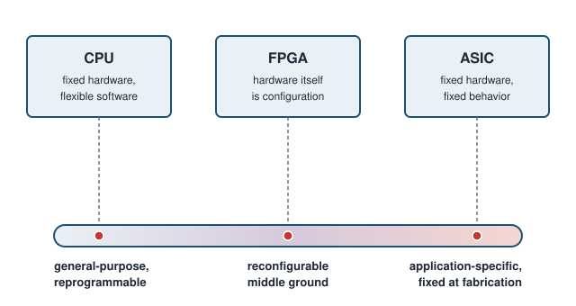
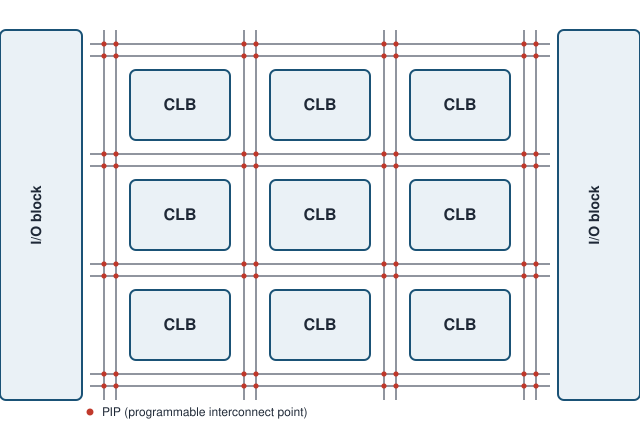
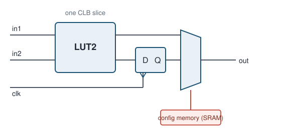
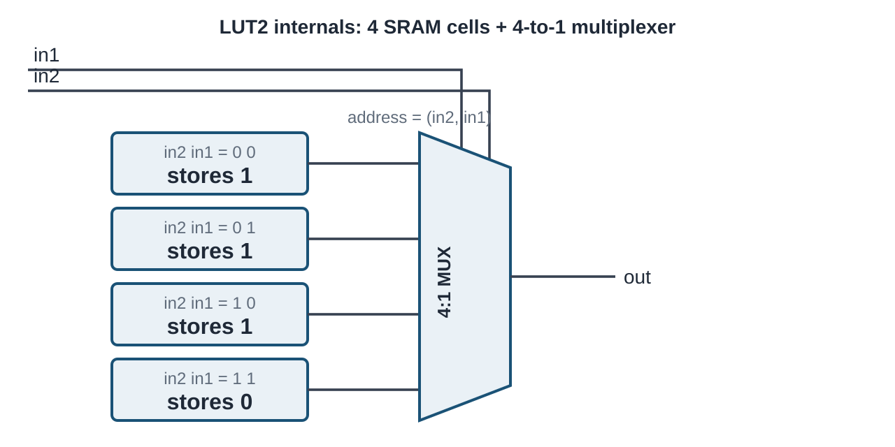
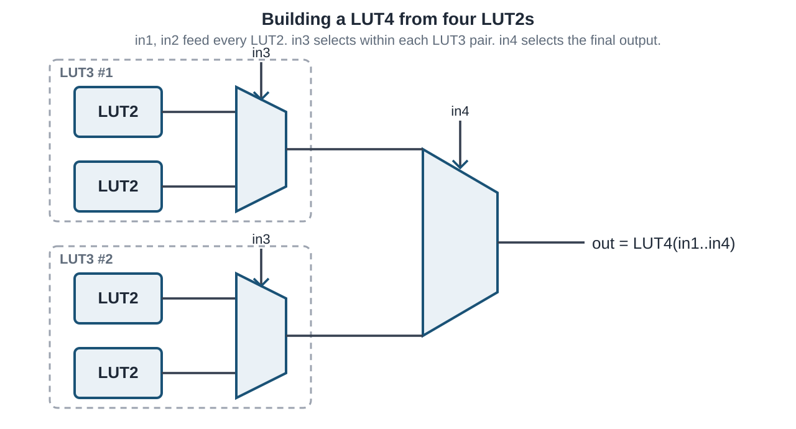
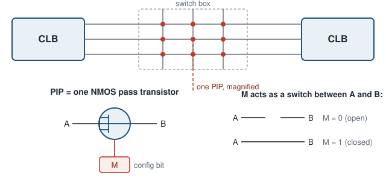
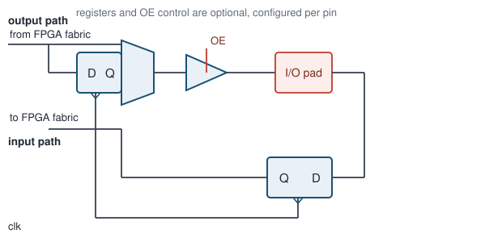

# FPGA Fundamentals {#sec-fpga-basics .unnumbered}

## Goal for this week

- Place the FPGA on the spectrum between a general-purpose CPU and a fixed
  ASIC, and see why that position makes it the right prototyping target for
  this course
- Break the FPGA fabric down into its three building blocks: CLB, routing
  plane, I/O blocks
- Open up a CLB far enough to see the LUT + flip-flop pair that will later
  become "the thing our synthesized SystemVerilog turns into"

## Why reconfigurable hardware?

::: {.content-visible when-format="revealjs"}
- CPU: fixed hardware, flexible software. One datapath, any program
- ASIC: fixed hardware, *no* software. A datapath built for exactly one job
- FPGA: hardware itself is configuration. Same silicon, different circuit
- **Discussion question:** if an ASIC is faster and more power-efficient
  than an FPGA doing the same job, why does this whole course run on FPGAs?
:::

::: {.content-visible unless-format="revealjs"}
As we saw in previous chapters, a CPU is a general-purpose integrated circuit: its function is defined not by its hardware but by the software program a developer writes for it. Development cost and time are low, since a single instruction set can be programmed in general-purpose or domain-specific languages to meet almost any demand — from database search to signal processing and beyond. But this same generality is also the CPU's biggest disadvantage. A CPU performs well on workloads like databases, yet it can be slow on compute-intensive problems such as neural network inference.

ASIC designs overcome this general-purpose bottleneck by mapping the application directly into hardware rather than software. A well-known example is Google's Tensor Processing Unit (TPU), built to accelerate the compute-intensive workloads of neural network inference. Its designers tailored the architecture to that one problem, wiring together a matrix of arithmetic logic units (ALUs) instead of following the standard CPU approach of a five-stage pipeline. Comparing a CPU and a TPU on neural network inference, the TPU wins decisively — but hand it a database search instead, and it is useless. This is the core limitation of ASIC accelerators: each one targets a single application, and once fabricated, it cannot be repurposed for anything else.

Comparing the CPU and the TPU, what we would really like is both properties at once: the flexibility to repurpose the device, and hardware tailored to the application at hand to squeeze out its full potential. Reconfigurable hardware, the field-programmable gate array (FPGA), gives us both, and its name spells out how. "Gate array" comes from the internal structure: logic blocks arranged on a matrix-like fabric, echoing the gate-array architecture used in some ASICs. "Programmable" does not mean the FPGA executes a software program in the traditional sense, though it can in a limited way. Instead, it refers to the reconfigurable property itself, achieved by loading a bitstream, a special binary configuration file, onto the device. "Field" refers to the field of application: an FPGA can adapt its internal structure to whatever application is at hand, out in the field, long after manufacturing.

This is exactly the trade-off an FPGA offers. It sits between the CPU
and the ASIC by turning the hardware itself into a form of software:
the logical function of every building block, and the
wiring between them, is set by the bitstream loaded after
manufacturing. We get most of an ASIC's advantage of "hardware built for
the job" without paying its fixed non-recurring engineering (NRE) cost or
its all-or-nothing commitment. That is exactly why this course
targets FPGAs. A mistake in a lab assignment costs a re-synthesis and a
few minutes, not a re-spun die. FPGAs are also the standard vehicle for
rapid prototyping and hardware acceleration in industry for the same
reason. Reconfigurability turns hardware design into something you can
iterate on.
:::

## The three building blocks

::: {.content-visible when-format="revealjs"}
- **CLB** (Configurable Logic Block): implements the logic itself
- **Routing plane**: programmable wiring that connects CLBs to each other
- **I/O blocks**: the boundary between the fabric and the outside world
:::

::: {.content-visible unless-format="revealjs"}
Every FPGA, regardless of vendor or generation, is built from the same
three kinds of block. CLBs (also called logic elements) sit in a regular
grid and implement the actual logic functions and storage of the design.
Between and around them runs the routing plane: a fabric of wires and
programmable switches whose only job is to connect a CLB's outputs to the
inputs of other CLBs, in whatever pattern the design needs. At the edges of
the die, I/O blocks connect the fabric to physical pins, translating
between the FPGA's internal signal levels and whatever the outside world
expects. None of these three blocks is useful without the other two: a CLB
with no routing to reach it is dead logic, and routing with nothing to
connect is just wire. Placing a design onto an FPGA is precisely the
problem of deciding which CLB implements which piece of logic (placement)
and which routing resources carry the signals between them (routing).
We will meet both steps again when we look at the FPGA design flow.
:::

### Configurable Logic Block (CLB)

::: {.content-visible when-format="revealjs"}
- A **look-up table (LUT)** implements combinational logic by memory
  lookup, not by wiring gates together
- A LUT's inputs act as an *address*. Its output is *the content of the
  addressed memory cell*
- Every CLB slice pairs a LUT with a flip-flop, and a mux picks which one
  drives the output
- That mux, like everything else configurable on the chip, is driven by a
  bit sitting in **configuration SRAM**
:::

::: {.content-visible unless-format="revealjs"}

The CLB is the main carrier of reconfigurability in an FPGA and its elementary building block. You can think of the CLB as the FPGA equivalent of an assembler instruction, the most basic element everything else is built from. The term itself differs across vendors. Xilinx calls it a logic slice, while Altera calls it a logic element. Either way, they refer to the same thing. As the primary building block for digital circuits, a CLB must support combinational logic, sequential logic, and combinations of the two. It consists of a look-up table (LUT), a flip-flop, and an output mux.

A LUT implements combinational logic through memory lookup rather than by wiring gates together. Structurally, it consists of SRAM (static random-access memory) cells paired with a multiplexer that selects which cell's content is forwarded to the output, based on the signal inputs. To see this concretely, consider the smallest useful case, a two-input LUT, or LUT2. With two inputs there are four possible input combinations, so a LUT2 is built from four memory cells and a 4-to-1 multiplexer. The two inputs act as the multiplexer's select lines, in other words as an *address*, and the output is simply whatever bit is stored in the addressed cell.

To implement logical functions with two input variables, you need to map the truth table into SRAM cells. For example to implement a two-input NAND on a LUT2, we do not build a NAND gate at all: we store the NAND truth table's output column (1, 1, 1, 0) into the four memory cells, in the order addressed by the two inputs,
and the LUT now behaves as a NAND for as long as that configuration is
loaded. The reconfigurability of LUTs is what makes FPGAs so flexible: the same LUT can just as easily hold an AND, an XOR, or any other two-input function. Reconfiguring the FPGA never touches a wire between gates. It only rewrites these memory cells. Because those cells are ordinary SRAM, they are volatile: power off the board and the "circuit" is gone, which is why every FPGA design needs a configuration step after every power-up.

We do not build larger LUTs as one giant memory array wired to a huge multiplexer. Instead, real FPGA architectures build them recursively from smaller LUTs, adding one extra input and one extra multiplexer stage at a time. A LUT3 is nothing more than two LUT2s, both fed by the same two inputs, with their outputs chosen between by a 2:1 mux controlled by the third input. Extending the same idea, a LUT4 is built from two LUT3s, each in turn built from two LUT2s, combined by one more 2:1 mux controlled by the fourth input. Each additional input doubles the number of underlying LUT2 building blocks and adds one more layer of multiplexing on top. This recursive structure is exactly why vendors describe their larger LUTs as fracturable: the same physical hardware that implements one LUT4 can, with a small configuration change, split back into two independent LUT3s, or four independent LUT2s, letting the synthesis tool pack more, smaller functions into fewer CLBs when a design does not need the full input width.

Few real digital circuits are purely combinational. Almost every design also needs elements that are synchronous to a clock. To support that, every CLB slice also includes a D flip-flop (DFF) fed from the LUT's output. As we saw earlier, a DFF copies its input (D) to its output (Q) on the active edge of the clock signal, clk. Through configuration bits, the developer can adapt that DFF's behavior, choosing whether it triggers on the rising or falling edge, and setting its initial or reset value. This exposes yet another layer of reconfigurability inside the CLB.

The last element of the CLB is the output mux, which picks between the raw
LUT output and the flip-flop's registered output. That
mux's select line is, like the LUT's memory cells, just another bit in
configuration SRAM. The same physical slice can act as combinational
logic or as a single-bit register, purely depending on how it is
configured. Real devices bundle several LUT + flip-flop slices, wider
LUTs, and extra logic (carry chains, muxes for combining LUTs into wider
functions) into one CLB. We look at a concrete example of that when we
cover a real device architecture later.

:::

### Routing plane: programmable interconnect

::: {.content-visible when-format="revealjs"}
- Routing has two jobs: combine many CLBs into one large design, and
  connect that design to the I/O blocks
- CLBs sit in a grid. The space between them carries wiring **tracks**
- Wherever tracks cross, a **switch box** may connect them
- Each connection point is a **PIP** (Programmable Interconnection Point)
- A PIP is, at the transistor level, just an NMOS pass transistor gated by
  a configuration SRAM bit. `M = 0` leaves the two tracks disconnected,
  `M = 1` ties them together
:::

::: {.content-visible unless-format="revealjs"}
Routing plays two closely related roles. First, it lets many individual
CLBs act as one large digital design: a real circuit needs far more logic
and storage than a single CLB slice can hold, so the design is spread
across hundreds or thousands of CLBs, and routing is what stitches their
individual outputs together into one coherent datapath. Second, routing
connects that internal logic to the outside world, joining CLBs to the
I/O blocks that carry signals in and out of the fabric. Without it, CLBs
and I/O blocks would be correct but disconnected islands of logic.

Between the rows and columns of CLBs run wiring tracks, and at every point
where a horizontal and a vertical track cross, a switch box can optionally
join them. The atomic component of a switch box is the PIP: a single NMOS
transistor used purely as a switch, with its gate driven by one
configuration SRAM bit. When that bit is 0, the transistor is off and the
two tracks it sits between are electrically separate. When it is 1, the
transistor conducts and the tracks become one net. A design's entire
wiring, meaning every connection from one CLB's output to another CLB's
input, reduces to which of these thousands of PIPs are turned on. This is
also why the router is typically the slowest step in the FPGA
implementation tools: placement decides which CLB does what, but routing
has to find, among a huge and only partially connected mesh of tracks and
switch boxes, one specific set of PIPs that realizes every net in the
design without any two nets shorting together.
:::

### I/O blocks

::: {.content-visible when-format="revealjs"}
- I/O blocks are the only place signals leave or enter the fabric
- Output side: optional register, then a **tri-state buffer** gated by an
  output-enable (OE) signal
- Input side: optional register on the way back into the fabric
- Whether a pin is an input, an output, or bidirectional is itself part of
  the configuration
:::

::: {.content-visible unless-format="revealjs"}
An I/O block is the boundary between the reconfigurable fabric and a fixed
physical pin, and it has to support more than "just wire a signal
through." On the output side, a signal from the fabric can optionally be
registered right at the pin before it reaches a tri-state buffer. That
buffer's output-enable (OE) input decides whether the pad is actively
driven at all, which is what makes a genuinely bidirectional pin possible.
The same pad can be released to high-impedance and read as an input
whenever the design is not driving it. The input side mirrors this with
its own optional register. Registering directly in the I/O block, rather
than in the nearest CLB, shortens the path the signal has to travel before
it is captured, which matters because I/O timing margins are usually
tighter than internal fabric timing. As with everything else on the chip,
whether each of these registers is used, and whether a pin behaves as
input, output, or bidirectional, is a configuration decision, not a fact
fixed at fabrication.
:::

### Reconfigurability, level by level

::: {.content-visible when-format="revealjs"}
- **LUT contents**: which function each LUT computes
- **DFF behavior**: edge sensitivity, reset/init value
- **Output mux**: combinational path or registered path
- **Routing PIPs**: which pairs of tracks are joined into one net
- **I/O block**: pin direction, register usage, output-enable
- **All five are the same primitive: one bit in configuration SRAM**
:::

::: {.content-visible unless-format="revealjs"}
We have now seen five separate places where a single configuration SRAM
bit changes what the FPGA does. Inside the CLB, one set of bits picks the
function stored in each LUT, another set picks whether the D flip-flop
triggers on the rising or falling edge and what value it resets to, and
one more bit decides whether the slice's output is the LUT's raw
combinational result or the flip-flop's registered one. Out in the
routing plane, a bit per PIP decides which pairs of tracks are joined into
the same net. At the I/O block, bits decide whether a register is used on
the input or output path, and whether a pin drives, receives, or does
both. None of these is a special case. Every one of them is the same
primitive: an SRAM cell whose value the configuration step writes before
the device does anything useful. What looks like five different kinds of
reconfigurability is really one mechanism, repeated at every point in the
fabric where a design decision has to be made. This is also, in one
sentence, what a bitstream is: the full list of values for every one of
these bits, for every CLB, PIP, and I/O block on the device.

## Case study: Xilinx Series-7 
:::
