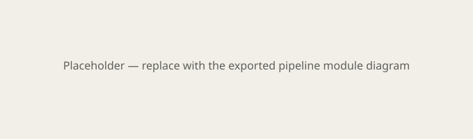

# Five-stage pipeline {#sec-pipeline-structure .unnumbered}

## Goal for this week

- Translate the well-known pipeline theory (IF/ID/EX/MEM/WB) into SystemVerilog
- Apply SystemVerilog syntax immediately on a real, motivating example
- Treat memory (for now) as an interface — the implementation follows next week

::: {.content-visible when-format="revealjs"}
**Discussion question:** why do we implement pipeline registers as separate
modules, instead of "hiding" them inside each stage?
:::

::: {.content-visible unless-format="revealjs"}
We implement pipeline registers as separate modules for two reasons.
First, pedagogically: each such register is a direct, visible example of a
D flip-flop (DFF) in the context of a real processor, which was an explicit
goal of the second part of the course. Second, practically: separate
modules with a fixed interface (see `pipeline_pkg.sv`) allow us to
substitute an individual stage with a reference ("golden") implementation
in the jigsaw testing methodology — discussed in more detail in the
verification chapter. This five-stage IF/ID/EX/MEM/WB structure follows
the classic pipelined datapath described by @patterson2017comporg.
:::

## Modules for this week

- `if_stage`, `if_id_reg`
- `id_stage` (`regfile`, `imm_gen`, `decoder`)
- `id_ex_reg`
- `ex_stage` (`alu`)
- (`mem_stage`, `wb_stage` — interface only for now, implementation next week)



## Example: `pipeline_pkg.sv`

```systemverilog
package pipeline_pkg;

  typedef enum logic [3:0] {
    ALU_ADD, ALU_SUB, ALU_AND, ALU_OR, ALU_XOR,
    ALU_SLL, ALU_SRL, ALU_SRA, ALU_SLT, ALU_SLTU
  } alu_ctrl_t;

  typedef struct packed {
    logic mem_read;
    logic mem_write;
    logic [1:0] mem_size;
    logic mem_unsigned;
  } mem_ctrl_t;

  typedef struct packed {
    logic reg_write;
    logic [1:0] wb_sel;
  } wb_ctrl_t;

endpackage
```

::: {.content-visible unless-format="revealjs"}
### Why a struct instead of individual signals

`typedef struct packed` is standard synthesizable SystemVerilog
[@ieee1800sv], so this pattern is portable across the tools you will use
this semester.

An alternative to the approach above would be for each control signal
(`mem_read`, `mem_write`, `reg_write`, ...) to travel through the pipeline
as a separate wire and a separate field in every pipeline register. This
quickly becomes unwieldy as the number of control signals grows — every
new signal requires a port change on every intermediate register. Using a
`typedef struct packed` instead, we define a single type that a pipeline
register carries as a whole; adding a new field to the struct does not
require changing the register's ports.
:::

## Next step

::: {.content-visible when-format="revealjs"}
Next week: hazards (forwarding, stall, branch flush)
:::

::: {.content-visible unless-format="revealjs"}
The next chapter covers the hazards that arise from this pipeline
structure: data hazards (resolved via forwarding or stalling) and control
hazards caused by resolving branches in the EX stage, which requires
flushing two instructions on a misprediction.
:::
